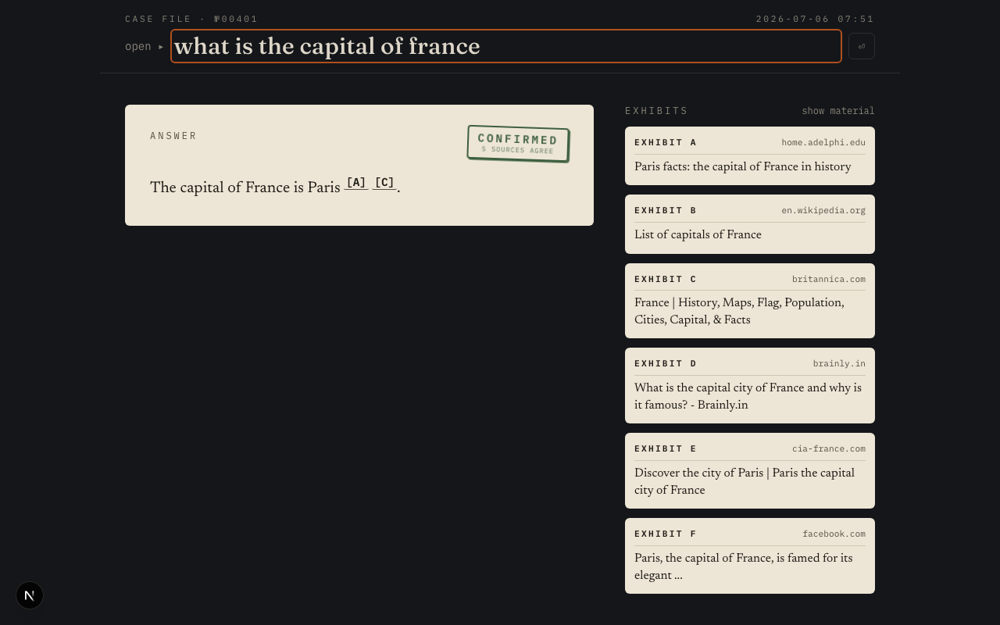
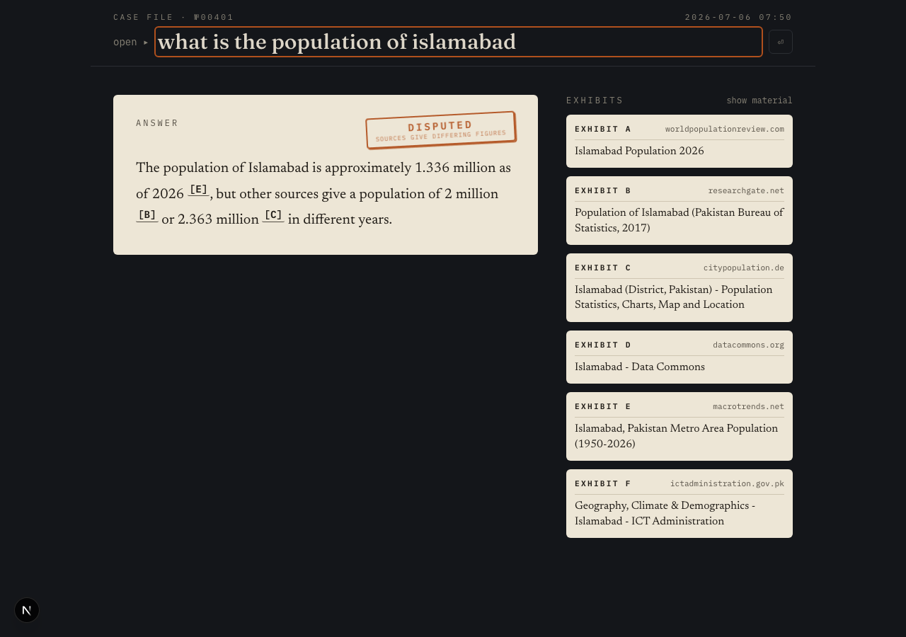
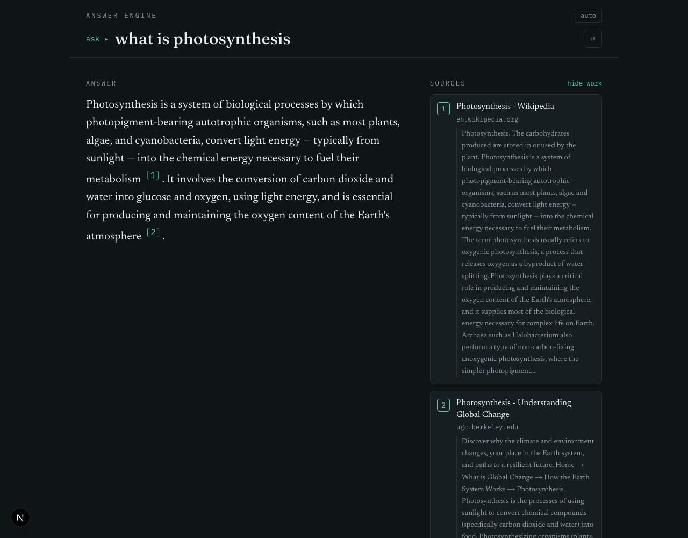
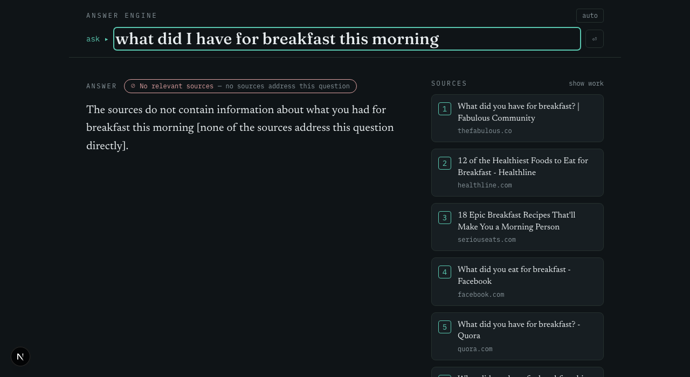

# Answer Engine

A Perplexity-style search tool: ask a question, get a synthesized answer with
inline citations — not a list of links to sift through. Every claim traces back to
a live source, and every source is one click away.

The actual differentiator: it **flags whether the sources agree, disagree, or don't
address the question at all** — instead of quietly blending everything into one
confident-sounding paragraph. Most answer-engine demos hide disagreement between
sources; this one surfaces it.

Built with Next.js, FastAPI, Tavily (web search), and Groq (LLM synthesis).

---

## What it does

Type a question. The engine:
1. Searches the live web for relevant sources (Tavily), then re-ranks them so
   authoritative sources outrank forums and social media.
2. Reads those sources and writes a single synthesized answer (Groq / Llama 3.3).
3. Cites every claim inline (`[1]`, `[2]`) — hover or click to see exactly where it
   came from.
4. Flags whether sources **agree**, **differ**, or are **irrelevant** to the question.

---

## What it looks like

**Citation linking** — hovering a `[n]` in the answer lights up its source card, so
you can trace any claim to its evidence:


**Source-agreement scoring** — when sources conflict, the engine says so instead of
blending contradictory figures into confident prose:

| Sources agree | Sources differ |
|---|---|
|  |  |

**Show your work** — reveal the raw retrieved snippets that fed the answer, i.e. the
retrieval step behind the polished output:



---

## Architecture

```
User query
   │
   ▼
Next.js frontend (localhost:3000)
   │  POST /search   (rate-limited, 10/min/IP)
   ▼
FastAPI backend (localhost:8000)
   │
   ├──▶ Tavily API — top ~6 web results (title, url, snippet)
   │       └─ snippet cleanup + domain-authority re-ranking
   │
   ▼
Groq (Llama 3.3 70B) — synthesizes an answer from the retrieved sources
   │  + classifies source agreement: agree / mixed / single / none
   ▼
Response: { answer, sources[], agreement, agreement_note }
   │
   ▼
Frontend renders answer + interactive citations + agreement badge + source cards
```

The core is the classic **RAG** pattern — retrieve, augment, generate — except
retrieval is a live web search rather than a vector database. The engine is split
into isolated modules (`engine/retriever.py`, `engine/synthesizer.py`,
`engine/formatter.py`), each with a single public function, so search and LLM
providers are swappable.

## Why Tavily + Groq

- **Tavily** is built specifically for LLM pipelines — it returns clean,
  content-focused snippets instead of raw HTML, cutting out the scraping/parsing a
  generic search API would need.
- **Groq** runs Llama 3.3 70B at very high speed on their LPU hardware, which matters
  because the pipeline already has one network round-trip (search) before generation
  starts — a slow LLM call on top of that would make the tool feel sluggish.

Both are swappable: the retriever and synthesizer are the only modules that would change.

---

## The agreement-scoring feature

Every answer is tagged with one state, shown as a badge above the answer:

- 🟢 **Sources agree** — multiple sources confirm the same answer
- 🟡 **Sources differ** — sources give conflicting numbers, dates, or opinions
  (shown explicitly in the answer text, not averaged away)
- ⚪ **Single source** — only one source actually addresses the question
- 🔴 **No relevant sources** — results came back, but none address the question

Getting the last two right was not trivial — see the Failure Log for the real bug
encountered while building it.

---

## Setup

Requires **Python 3.11+** and **Node 18+**.

### 1. API keys

Both providers have free tiers. Sign up at <https://tavily.com> and
<https://console.groq.com>.

```bash
cp .env.example .env
# then edit .env and fill in TAVILY_API_KEY and GROQ_API_KEY
```

### 2. Backend (CLI + API)

```bash
pip install -r requirements.txt
```

**CLI:**

```bash
python search.py "what is retrieval augmented generation"
python search.py "history of the internet" --num-results 3
python search.py "best python web framework" --raw   # skip the LLM, dump sources
```

**API:**

```bash
uvicorn api.main:app --reload
# POST http://localhost:8000/search  {"query": "..."}
# interactive docs at http://localhost:8000/docs
```

### 3. Frontend

```bash
cd frontend
npm install
npm run dev        # http://localhost:3000  (expects the API on :8000)
```

---

## Known Limitations

Documented on purpose — a system that documents its failure modes is easier to trust
than one that hides them.

- **Answer quality is bounded by search quality.** If Tavily returns weak or
  off-topic sources, the answer will be weak. The cite-only prompt keeps the model
  honest about it, but it can't invent good sources.
- **Authority re-ranking is a heuristic, not a truth oracle.** It uses a curated
  domain list plus `.gov`/`.edu` rules to float credible sources above forums and
  social media. Country-specific government domains (e.g. `.gov.pk`) aren't caught by
  the bare-`.gov` rule, and a low-authority page can still be correct.
- **Agreement scoring is LLM-judged**, so it assesses what the *snippets* say, not
  ground truth. It's good at flagging obvious conflicts (e.g. differing population
  figures) and shouldn't be read as a fact-check.
- **No conversation memory.** Each query is independent; no multi-turn follow-up yet.
- **No streaming yet.** The full answer arrives at once after retrieval + generation;
  the UI shows a staged loading readout in the meantime.
- **Rate limiting is in-memory** (10 req/min/IP). Fine for a single instance; a
  multi-instance deploy would need a shared store (e.g. Redis).

---

## Failure Log

Real bugs found during testing, and how they were fixed. Included deliberately.

### Bug: mislabeled "no relevant sources" case

**What happened:** Asking an unanswerable question (e.g. "what did I have for
breakfast this morning") returned 6 sources, none relevant — but the badge read
**"Single source,"** which is misleading when 6 sources are clearly listed.

**Root cause:** The agreement classifier only had three categories — `agree`,
`mixed`, `single`. There was no honest option for "results came back, but they're all
irrelevant," so the output got forced into `single` by the validation layer even when
several sources were returned.

**Fix:**
1. Added a `none` category for "results returned, but off-topic or irrelevant."
2. Replaced the blind fallback-to-`single` with a default based on actual retrieved
   source count — a stray `single` with multiple sources present now auto-corrects.
3. Added a distinct frontend badge (`⊘ No relevant sources`, in red) so this case is
   visually separate from a genuine single-source answer.

**Verified:** Re-tested with genuinely unanswerable queries ("what did I have for
breakfast this morning," "grains of sand in my left shoe") — both correctly returned
`none`. Previously-passing `agree`/`mixed` cases were unaffected.



### Bug: verbose answers on simple factual questions

**What happened:** Simple questions (e.g. "what is the capital of Pakistan") produced
long, over-cited answers — up to 5 sources across several sentences, with a redundant
closing sentence re-listing every citation.

**Root cause:** The system prompt didn't distinguish simple single-fact questions from
genuinely ambiguous ones — it always aimed for maximum source coverage.

**Fix:** Updated the prompt to answer simple factual questions in 1–2 sentences with
at most two citations per claim, and to drop the citation-restacking summary sentence.
Longer multi-source synthesis is reserved for genuinely ambiguous or disputed questions.

**Verified:** "capital of France" and "capital of Pakistan" now return one clean
sentence with 1–2 citations. Ambiguous questions ("population of Lahore," "Python vs
JavaScript") still produce longer, multi-source answers when warranted.

### Bug: source quality — low-authority results ranked alongside credible ones

**What happened:** Tavily returned forums, social media, and quiz sites interleaved
with authoritative sources (Wikipedia, Britannica, government sites), so weak sources
sometimes got the leading citation.

**Fix:** Added a domain-authority re-ranker in the retriever. It stable-sorts results
into three tiers (high: encyclopedias, `.gov`/`.edu`, reference works; neutral; low:
forums, social, quiz sites), preserving relevance order within each tier. Nothing is
dropped — a weak source that's the only match still survives, it just sinks.

**Verified:** "who painted the mona lisa" now leads with Wikipedia → Britannica → PBS,
with Reddit/Facebook/Instagram sunk to the bottom.

### Bug: stray quote character leaking into search input

**What happened:** Queries pasted with wrapping or smart quotes left a stray `"`
visible in the search input and polluted the web search.

**Fix:** Added input sanitization at submission — strips wrapping quotes (`"query"`),
normalizes smart quotes, and removes stray leading/trailing quotes, while preserving
genuine mid-phrase quotes. Also fixed a related bug where clicking a recent-history
query didn't update the visible input.

**Verified:** `What does "carpe diem" mean` renders cleanly and returns a correct
answer with no input corruption; mid-phrase quotes like `say "hello"` are preserved.

---

## Test Coverage

Manually tested end-to-end. Results below are from actual runs against the live app.

| Category | Example query | Result |
|---|---|---|
| Simple factual | "what is the capital of France?" | ✅ `agree` — "Paris", concise, 5 sources agree |
| Contradiction handling | "what is the population of Lahore?" | ✅ `mixed` — flagged 13M (2023 census) vs ~15M estimates, no false consensus |
| Superlative / reference | "what is the tallest mountain in the world?" | ✅ `agree` — Everest, led by Britannica + Wikipedia |
| Opinion-based | "is Python better than JavaScript?" | ✅ `mixed` — flagged as differing opinions, balanced answer |
| Unanswerable / out of scope | "what did I have for breakfast this morning?" | ✅ `none` — refused to fabricate, badge shows "No relevant sources" |
| Current events | "who won the Nobel Prize in Physics in 2025?" | ✅ `agree` — Clarke, Devoret, Martinis; cited nobelprize.org, UCSB, CUNY |
| Special characters in input | `What does "carpe diem" mean` | ✅ No input corruption; correct cited answer |
| Backend failure | server unreachable mid-query | ✅ Clean "Search interrupted" message, no crash or blank screen |
| Mobile responsiveness | 400px viewport | ✅ Layout holds, no horizontal overflow |

---

## Roadmap

- [ ] Streaming responses (Groq supports this)
- [ ] Multi-turn / follow-up query support
- [ ] Deploy: frontend → Vercel, backend → Render/Railway
- [ ] Shared-store rate limiting (Redis) for multi-instance deploys

---

## Project layout

```
.
├── search.py              # CLI entrypoint
├── engine/
│   ├── retriever.py       # Tavily search + snippet cleanup + authority ranking
│   ├── synthesizer.py     # Groq LLM: cited answer + agreement scoring
│   ├── formatter.py       # CLI output formatting
│   └── errors.py          # shared exception types → clean messages
├── api/
│   └── main.py            # FastAPI /search endpoint (CORS + rate limiting)
├── frontend/              # Next.js app (App Router, TypeScript, Tailwind)
├── requirements.txt
├── .env.example
└── docs/screenshots/
```

## Tech Stack

- **Frontend:** Next.js 16 (App Router), TypeScript, Tailwind CSS
- **Backend:** FastAPI (Python), slowapi (rate limiting)
- **Search:** Tavily API
- **LLM:** Groq (Llama 3.3 70B)
